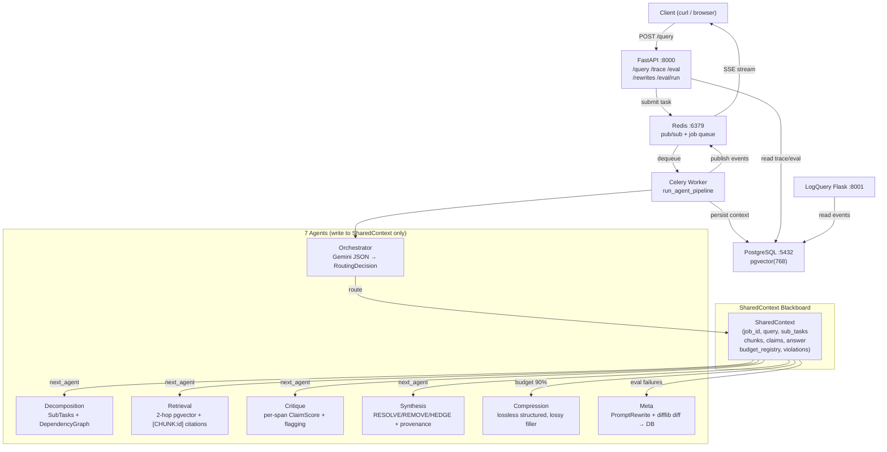

# MEGA-AI Architecture

## Mermaid Diagram

## Data Flow

1. Client `POST /query` → API creates `job_id`, submits Celery task
2. Celery task creates `SharedContext`, starts orchestrator loop
3. Orchestrator calls Gemini → `RoutingDecision` → next agent
4. Agent runs, writes outputs to `SharedContext`, publishes SSE events to Redis
5. Loop continues until synthesis complete or `MAX_TURNS` reached
6. Context persisted to PostgreSQL, `done` event published to Redis
7. Client receives final answer via SSE stream

## Key Design Decisions

### Why SharedContext (Blackboard Pattern)?
Agents do NOT call each other directly. This eliminates cascading failures, makes the execution trace fully reproducible, and allows any agent to be replaced without breaking others.

### Why asyncio.Lock in ContextBudgetManager?
The budget manager must be safe across concurrent sub-task execution in the DependencyExecutor. threading.Lock would deadlock inside an async event loop.

### Why len(text)//4 instead of tiktoken?
Gemini API does not expose token counts per-request. The heuristic is deterministic, dependency-free, and accurate enough for budget tracking (not billing).

### Why NEVER silently truncate?
Silent truncation hides data loss from the debugging trace. An explicit BudgetOverflowError forces the system to route to the Compression agent, which makes the compression decision auditable.
