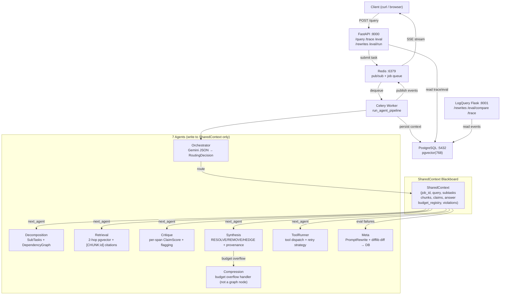

# MEGA-AI Architecture

MEGA-AI is designed as an asynchronous, event-driven orchestration system capable of running heavy, multi-turn LLM agent pipelines without blocking the main API thread.

## 1. System Topology (Mermaid)

---

## 2. Component Breakdown

### A. FastAPI Server (The Gateway)
The entry point for all client requests.
- **Responsibility:** Accepts queries, performs Layer 1 injection detection, dispatches jobs to Redis, and holds open a Server-Sent Events (SSE) connection to stream progress back to the user.
- **Security:** Fully isolated from the execution environment. The API server *cannot* execute tools or read the knowledge base directly.
- **Exactly 5 endpoints** are exposed on port 8000. All analytical/diagnostic routes (`/rewrites`, `/eval/compare`) live in the LogQuery service on port 8001.

### B. Celery Worker (The Engine)
A heavy background process running via Redis broker.
- **Responsibility:** Dequeues jobs and instantiates the `StateGraph` Orchestrator.
- **Configuration:** Set to `task_acks_late=True` and `worker_prefetch_multiplier=1` to ensure that long-running LLM tasks (often >15 seconds) are not lost if the worker crashes mid-execution.
- **Budget Initialization:** Before any agent runs, the worker explicitly calls `budget_mgr.declare_budget()` for all 7 agents with their designated token limits. This guarantees `preflight_check()` never raises a `KeyError` for undeclared agents.
- **Mock Support:** Setting `MOCK_LLM=true` patches all Gemini clients to return deterministic stub responses, enabling full pipeline testing without API quota consumption.

### C. PostgreSQL + pgvector (The Memory)
The single source of truth for both knowledge and execution state.
- **Knowledge Base:** Uses `pgvector` with a strict `vector(768)` dimension limit (aligned to Google's `text-embedding-004`).
- **Trace Persistence:** After a Celery task completes, the entire `SharedContext` state, along with every granular `execution_event`, `routing_decision`, and `tool_call`, is serialized and saved here.

### D. Redis (The Bridge)
Serves a dual purpose:
1. **Message Broker:** Queues tasks for Celery.
2. **Pub/Sub Channel:** The Celery worker publishes live execution events (`BUDGET_UPDATE`, `TOKEN`, `HANDOFF`) to Redis channels, which the FastAPI server subscribes to and forwards as SSE chunks to the client.

**Note:** Redis pub/sub has no persistence. If a client disconnects during a run, missed SSE events can be reconstructed via `GET /jobs/{id}/trace` from the PostgreSQL log.

### E. LogQuery Service (The Inspector)
A lightweight Flask application on port 8001.
- **Purpose:** Provides a human-readable UI for browsing execution traces, comparing eval runs, and reviewing/managing prompt rewrites.
- **Data Source:** Queries the PostgreSQL `execution_events`, `routing_decisions`, `tool_calls`, and `prompt_rewrites` tables directly.
- **Endpoints exposed here** (not on port 8000): `GET /rewrites`, `GET /eval/compare`, `GET /trace`.

### ToolRunner
The 6th agent in the LangGraph pipeline. Decides which tool to call and manages
retry strategy (3 attempts max per tool). All tool calls are logged to the
`tool_calls` table with inputs, outputs, errors, and retry count.
Note: Was unwired in early versions. Connected to the graph in final commit.

### Compression (Budget Overflow Handler)
Not a LangGraph graph node. Triggered conditionally by Synthesis when context
exceeds the token budget threshold. Operates directly on `final_answer` via
`compress()`. The budget-threshold trigger in `run()` is not reached during
normal pipeline execution — only activates under budget pressure.

---

## 3. The Execution Data Flow

1. **Submission:** Client sends `POST /query`.
2. **Validation:** API checks for basic prompt injections. If safe, generates a UUID `job_id`.
3. **Dispatch:** API pushes the task to Redis. The API immediately subscribes to the Redis Pub/Sub channel for `job_id`.
4. **Initialization:** The Celery Worker dequeues the task, builds a `SharedContext`, declares all 7 agent budgets, then hands the context to the Orchestrator.
5. **Multi-Agent Loop:** The Orchestrator routes the context through Decomposition, Retrieval, Critique, and Synthesis. During this, the worker publishes live updates back to Redis.
6. **Completion:** Synthesis finishes. The Worker persists the final `SharedContext` state to PostgreSQL and publishes a `DONE` event.
7. **Delivery:** The FastAPI server forwards the final answer and closes the SSE stream gracefully.

---

## 4. Key Design Decisions

### Why the SharedContext (Blackboard) Pattern?
In naive multi-agent systems, Agent A calls Agent B directly (e.g., Autogen). This creates tightly coupled, brittle code where a failure in B crashes A.
By forcing all 7 agents to communicate *exclusively* by reading and writing to the `SharedContext` Pydantic model:
- **Reproducibility:** We can rebuild the exact state of the pipeline at any millisecond.
- **Fault Isolation:** If an agent fails, the Orchestrator can cleanly catch the error, log a policy violation, and route to a fallback agent without crashing the stack.

### Why `asyncio.Lock` in the ContextBudgetManager?
Because the Decomposition agent can create parallel subtasks that execute concurrently, multiple agents might attempt to consume tokens simultaneously. A standard `threading.Lock` would deadlock the Python `asyncio` event loop. Using `asyncio.Lock` ensures thread-safe token accounting.

### Why Declare Budgets Upfront (Not Lazily)?
An early design lazily declared budgets on first use. This caused `preflight_check()` to raise `KeyError` for agents that hadn't yet been called. All budgets are now declared at `_run_pipeline_async` startup — before the LangGraph pipeline runs — so the budget registry is always complete regardless of which agent the Orchestrator routes to first.

### Why NEVER Silently Truncate?
Many systems silently truncate context windows when they approach token limits. MEGA-AI explicitly forbids this. Silent truncation hides data loss from the execution trace. Instead, MEGA-AI throws a `BudgetOverflowError`, forcing a formal trigger of the **Compression** utility (Budget Overflow Handler). This makes the decision to compress explicit, auditable, and logged as a `COMPRESSION_TRIGGERED` event.

### Why a Separate Judge Model?
The eval harness uses `gemini-2.5-flash` as the judge, while the pipeline uses `gemini-2.5-flash` as the generator. Different model checkpoints prevent self-enhancement bias — the tendency of a model to rate its own outputs artificially high because it recognizes its own linguistic patterns.
